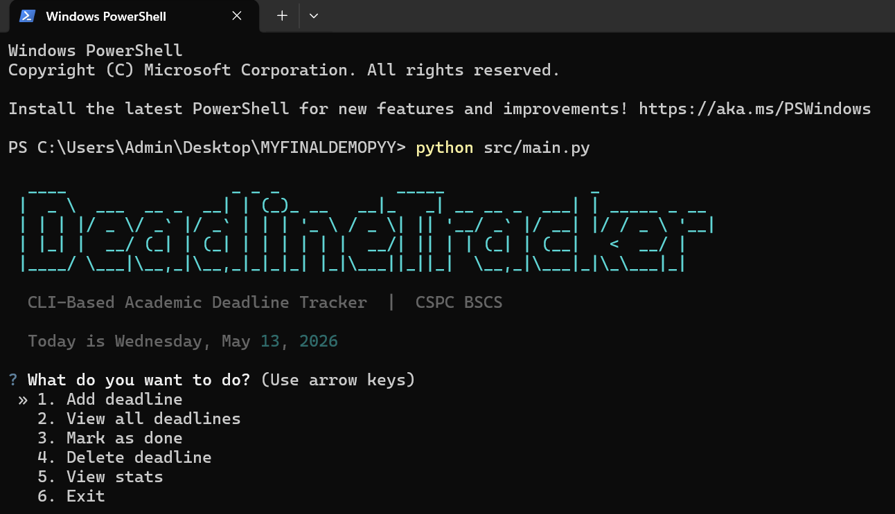
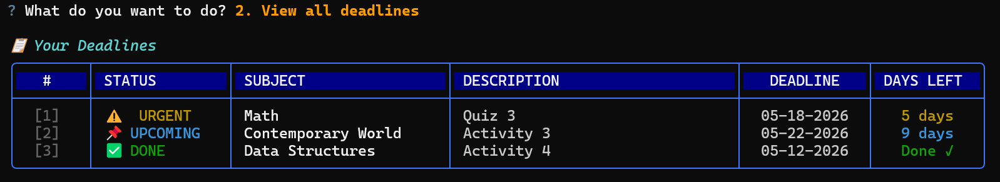
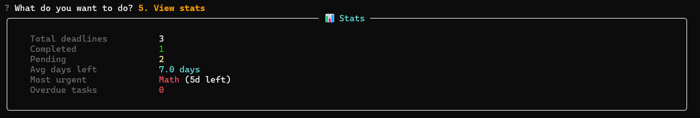

# 📅 Deadline Countdown Tracker

A CLI-based academic deadline tracker built in Python.  
Helps students organize and monitor their subject deadlines with urgency indicators, descriptions, and statistics — all from the terminal.

---

## ✨ Features

- ➕ **Add deadlines** — enter subject, description, and due date `(MM-DD-YYYY)`
- 📋 **View all deadlines** — sorted by urgency in a numbered, color-coded table
- ✅ **Mark as done** — select a deadline by number to complete it
- 🗑️ **Delete deadlines** — remove a deadline by number with a confirmation prompt
- 📊 **View statistics** — total, completed, pending, average days left, most urgent, overdue count
- 💾 **Auto-save** — data persists between runs via JSON file storage

---

## 🚦 Status Indicators

| Status | Meaning |
|--------|---------|
| 💀 **OVERDUE** | Past the due date |
| 🔴 **DUE SOON** | 0–2 days left |
| ⚠️ **URGENT** | 3–7 days left |
| 📌 **UPCOMING** | 8+ days left |
| ✅ **DONE** | Completed |

---

## ⚙️ Installation & Setup

**Requirements:** Python 3.8+

**1. Clone the repository:**

```bash
git clone https://github.com/Raiku99x/Morillo_JohnLhoel_FinalProject.git
cd Morillo_JohnLhoel_FinalProject
```

**2. Install dependencies:**

```bash
pip install -r requirements.txt
```

**3. Run the application:**

```bash
python src/main.py
```

---

## 🖥️ Sample CLI Usage

**Main Menu**



**Viewing Deadlines**



**Statistics**



---

## 📁 Project Structure

```
Morillo_JohnLhoel_FinalProject/
│
├── README.md
├── requirements.txt
│
├── src/
│   ├── main.py         # Entry point — CLI menu loop and action handlers
│   ├── deadline.py     # Deadline class — attributes, status logic, serialization
│   └── tracker.py      # DeadlineTracker class — CRUD, persistence, statistics
│
└── data/
    └── deadlines.json  # Auto-generated on first run
```

---

## 🧠 Python Concepts Demonstrated

| Concept | Where Applied |
|---------|---------------|
| **OOP (Classes & Objects)** | `Deadline` class (`deadline.py`) and `DeadlineTracker` class (`tracker.py`) with attributes and methods |
| **File Handling** | `tracker.py` — `save()` and `load()` using `json.dump` / `json.load` for persistent storage |
| **Data Structures** | Lists of `Deadline` objects, dictionaries for JSON serialization, dictionary-based action map in `main.py` |
| **Sorting Algorithm** | Custom `sorted_deadlines()` using a tuple sort key `(priority, days_left)` to order by urgency |
| **Statistics Module** | `statistics.mean()` in `show_stats()` to compute average days remaining across pending deadlines |
| **Type Hints** | All function signatures and variables annotated (`List[Deadline]`, `Optional[str]`, etc.) |
| **Docstrings** | Google-style docstrings on every class, method, and module |
| **Input Validation** | `get_date()` loops until a valid MM-DD-YYYY date is provided; empty-string checks on all text fields |
| **Error Handling** | `try/except` wraps all menu actions; invalid integers caught with `ValueError` |

---

## 🎥 Video Demonstration

▶️ [Watch on YouTube](https://youtu.be/iqfC8UwimvA?si=z2OoqQVUy_Z3ysaU)

---

## 👨‍💻 Author

**Morillo, John Lhoel A.**  
BSCS — Camarines Sur Polytechnic Colleges
